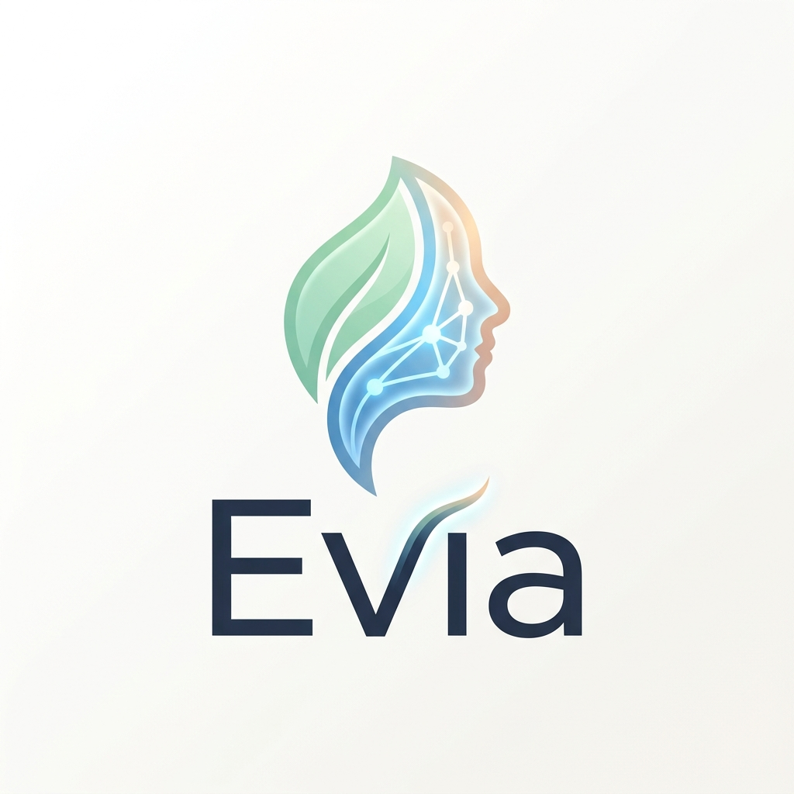
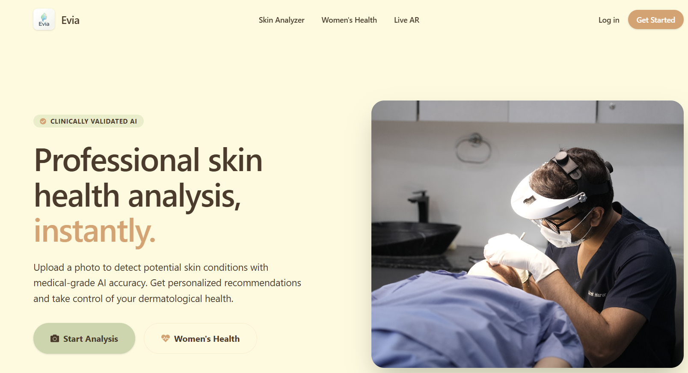
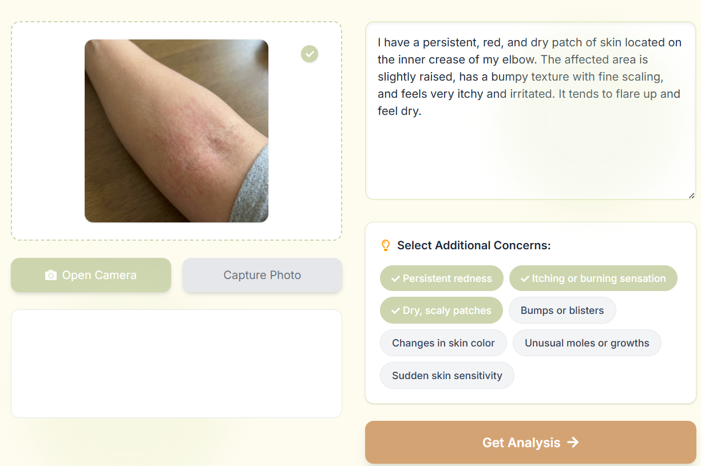
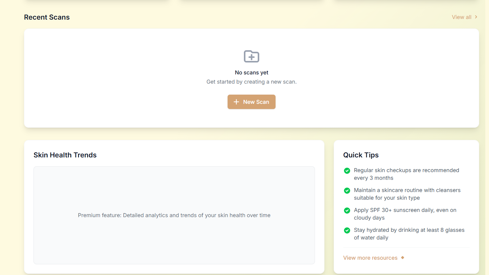
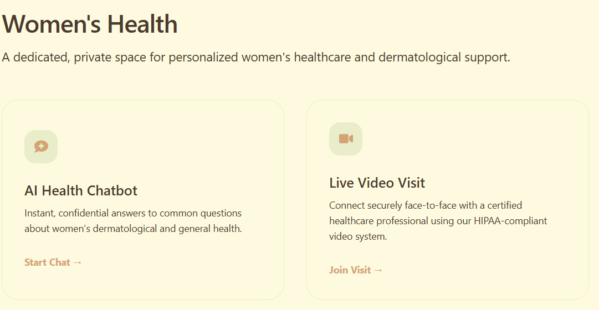

<div align="center">
  <!-- TODO: Provide path to your project's logo below -->
  

  # Evia
  
  **An advanced AI-powered skin health analysis platform for personalized recommendations and early detection.**

  [**🚀 View Live Demo**](https://evia-mocha.vercel.app/)

  [](https://nextjs.org)
  [](https://reactjs.org/)
  [](https://flask.palletsprojects.com/)
  [](https://www.mongodb.com/)

  <br />

  

</div>

---

## 🌍 Project Overview

**Evia** bridges the gap between individuals and advanced dermatological care. It consolidates AI-driven skin analysis, personalized women's health consultation, Live AR visualization, and nearby clinic discovery into one seamless web experience.

Developed with a modern tech stack, Evia features a **production-ready Next.js application** coupled with a powerful **Flask Python Backend**. It leverages Gemini AI for intelligent analysis, offering robust user dashboards, interactive mapping, and comprehensive skin health tracking.

---

## ✨ Key Features

*   📸 **AI Skin Analyzer:** Upload images for instant AI analysis of skin conditions using Google's Gemini models.
*   💬 **Women's Health Assistant:** A specialized, context-aware chatbot designed to answer women's health inquiries safely.
*   👓 **Live AR Visualizer:** Real-time augmented reality to visualize and educate users on various skin conditions.
*   🗺️ **Clinic Locator:** An interactive map powered by Leaflet to find nearby dermatologists and skin care clinics without API keys.
*   📊 **User Dashboard:** Track previous scan history, confidence scores, and profile statistics.
*   🛡️ **Secure Authentication:** Full NextAuth integration with Prisma for secure login, registration, and session management.

---

## 🏗️ Architecture

Evia utilizes a dual-backend architecture, separating the frontend UI server from the heavy AI processing server.

```text
Evia/
├── frontend/                # Next.js Frontend Application
│   ├── public/             # Static assets (Images, Icons)
│   ├── src/app/            # App Router (Pages, Layouts, API Routes)
│   ├── src/components/     # Reusable UI components
│   └── prisma/             # Database schema and ORM migrations
├── backend/                # Flask Python Backend
│   ├── app.py              # Flask server and Gemini AI integration
│   ├── requirements.txt    # Python dependencies
│   └── .env                # Backend environment configurations
└── README.md               # Project documentation
```

### Request Flow
`Client (Browser)` ➡️ `Next.js App Server (Port 3000)` ➡️ `Prisma / MongoDB`  
`AI Features` ➡️ `Flask API (Port 5000)` ➡️ `Gemini AI Model`

---

## 📸 Application Gallery

| Landing Page | Scan Upload |
| :---: | :---: |
|  |  |

| Dashboard | Women's Health Chat |
| :---: | :---: |
|  |  |


---

## ⚙️ Installation & Local Development

**Prerequisites:** 
- [Node.js](https://nodejs.org/) v18.0+
- [Python](https://www.python.org/) 3.10+
- [MongoDB](https://www.mongodb.com/try/download/community) connection string

1. **Clone the repository:**
   ```bash
   git clone https://github.com/keesha-luthra/Evia.git
   cd Evia
   ```

2. **Setup the Python Backend:**
   ```bash
   cd Evia/backend
   python -m venv venv
   source venv/bin/activate  # On Windows use: venv\Scripts\activate
   pip install -r requirements.txt
   ```

3. **Configure Backend Environment:**
   Create a `.env` file in `Evia/backend/` with the following variables:
   ```env
   GEMINI_API_KEY=your_gemini_api_key
   PORT=5000
   ```

4. **Setup the Next.js Frontend:**
   ```bash
   cd Evia/frontend
   npm install
   ```

5. **Configure Frontend Environment:**
   Create a `.env` file in `Evia/frontend/` with the following variables:
   ```env
   DATABASE_URL="mongodb+srv://..."
   NEXTAUTH_SECRET="your_secret"
   NEXTAUTH_URL="http://localhost:3000"
   NEXT_PUBLIC_BACKEND_URL="http://localhost:5000"
   ```

6. **Start the applications:**
   
   *Start the Backend API:*
   ```bash
   # From Evia/backend/
   python app.py
   ```
   
   *Start the Next.js Server:*
   ```bash
   # From Evia/frontend/
   npm run dev
   ```
   *Navigate to `http://localhost:3000`*

---

## 🔒 Environment Variables

Environment variables are required for full functionality. 

**Frontend (`Evia/frontend/.env`)**
| Variable | Type | Description |
| :--- | :--- | :--- |
| `DATABASE_URL` | `string` | MongoDB connection string for Prisma. |
| `NEXTAUTH_SECRET` | `string` | Secret string used for JWT/Session signing. |
| `NEXT_PUBLIC_BACKEND_URL` | `string` | URL to the Flask backend (default `http://localhost:5000`). |

**Backend (`Evia/backend/.env`)**
| Variable | Type | Description |
| :--- | :--- | :--- |
| `GEMINI_API_KEY` | `string` | API key from Google AI Studio. |

---

## 🔮 Future Improvements

While Evia is feature-rich, our roadmap includes:

1. **Tele-Medicine:** Integrating robust WebRTC workflows for live dermatologist consultations.
2. **Mobile App:** Packaging the web application into a React Native wrapper for native mobile experiences.
3. **Enhanced AI Models:** Fine-tuning specific dermatological models for higher accuracy alongside Gemini.

<div align="center">
  <br/>
  <p>Built with ❤️ to revolutionize digital dermatology.</p>
</div>
